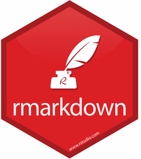
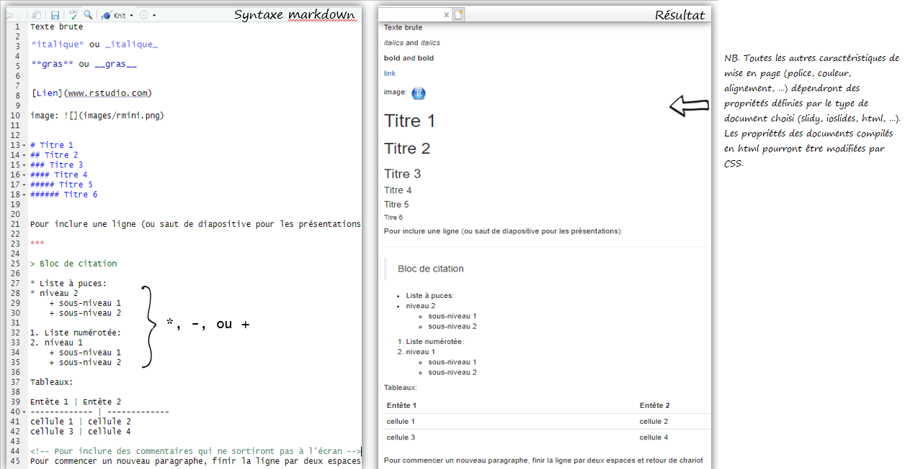
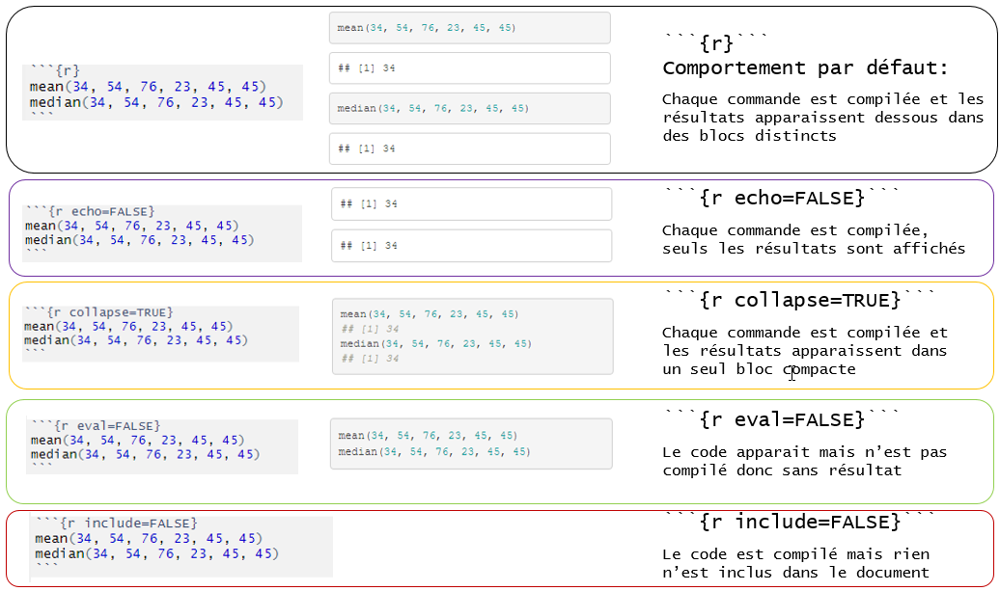

```{r setup, include=FALSE}
knitr::opts_chunk$set(echo = TRUE)
```


# 1. Objectifs

<div style="position: fixed; top: 20; right: 0;">


</div>

- Se familiariser avec l'environnement de RStudio pour la création de documents dynamiques.

- Comprendre l'anatomie d'un document R Markdown.

- Comprendre les différents formats et paramétrages de base.

- Apprendre les bases du balisage Markdown.

- Apprendre à structurer un document .rmd pour le compiler en différents formats.

- Apprendre comment partager son document en ligne (avec URL).


# 1. Objectifs

## Ce que l'on ne fera pas:

- LaTeX pour compiler des documents pdf: nécessite installation d'une distribution TeX comme  [MiKTeX](http://miktex.org/download), [TinyTeX](https://yihui.name/tinytex/)...

- Git et Github pour archiver et partager en ligne

- **Apprendre R!**

<br>

<center>


</center>

# 2. Ce dont on aura besoin (le minimum nécessaire)

<br>

- [R](https://cran.r-project.org/bin/windows/base/)
- [RStudio](https://rstudio.com/products/rstudio/download/) 
- Packages/outils de RStudio:
  - [knitr](https://cran.r-project.org/web/packages/knitr/index.html)
  - [R Markdown](https://rmarkdown.rstudio.com/)
  - [Pandoc](https://rmarkdown.rstudio.com/docs/articles/pandoc.html)


# 3. **RStudio** (et autres IDE)  

<br>

- Interface du **R** de base pas très intuitive donc peu utilisée telle quelle  


<center>


</center>  

<br>

- Installe généralement en plus un IDE,  *Integrated Development Environment*:  éditeur de script - environnement beaucoup plus convivial qui facilite le travail (gestion des fichiers, objets et commandes, historique de fonctions, autocomplétion,…)
- L’IDE le plus utilisé est **RStudio** (mais il y en a d’autres comme **Tinn-R**).
- Les commandes et fonctions sont les mêmes pour **R** et **RStudio**.


# 4. Installation  

1. Télécharger et installer [**R de base**](https://cran.r-project.org/) - choisir son système d’exploitation et suivre les étapes.

2. Télécharger et installer  [**RStudio**](https://www.rstudio.com/products/rstudio/download/#download) (ou autre interface) – Choisir la version gratuite et son système d’exploitation.

3. Télécharger et installer ("charger") des *packages* dans **RStudio**.

<br>

- À noter
    + Pas de mises à jour automatiques, il faut installer une nouvelle version et retélécharger les *packages* (ou déplacer le répertoire de l’ancienne version et faire `update.packages`). **RStudio** utilisera par défaut la version la plus récente sur le poste (peut se faire manuellement). L'ancienne version peut être désinstallée. Il est recommandé de mettre à jour sa version R et RStudio annuellement.
    + Certains besoins plus spécialisés peuvent nécessiter l'installation d'outils supplémentaires comme [*RTools* (Windows) et *LaTeX*](http://cran.r-project.org/doc/manuals/R-admin.html#The-Windows-toolset).
    + Package utile pour la mise à jour de R et autres outils sous Windows via RStudio:  `installr`


# 5. Qu’est-ce qu’un *package*? 

<br>

- Un *package* est un module (ou extension, librairie, bibliothèque) qui contient un ensemble de fonctions (souvent liées à une méthode ou un domaine particulier)
- À l’installation, **R** vient avec un ensemble de fonctions de base {base} et de modules par défaut (*built in packages*).
- Des *packages* composés de fonctions spécialisées sont constamment développés par la communauté.
- On en trouve plus de 15 000 sur le site officiel de **R** [CRAN](https://cran.r-project.org/web/packages/). D'autres se trouvent aussi ailleurs (Github, …).
- Les packages doivent être **téléchargés**(`install.packages()` ou via le menu du haut *Tools > Install Packages*) une seule fois, mais **chargés** (`library()` ou `require()`) à chaque session.
- Une fonction (ex: corrélation, tableaux contingences…) peut se retrouver dans plusieurs packages avec variantes plus ou moins importantes (procédures, options, arguments, résultats).
- Les packages nécessitent aussi une mise à jour périodique via: Tools -> Check for Package Updates


# 6. Qu'est-ce R Markdown et pourquoi l'utiliser ?


- R Markdown est un package installé par défaut dans RStudio.

- Outils de **programmation lettrée** créé pour assurer la **reproductibilité** de la recherche en intégrant dans un seul document du texte balisé en Markdown, le code (R ou autre) et résultats de ses analyses.

- C'est la version "moderne" et simplifiée d'autres outils utilisés depuis plusieurs décennies par les chercheurs adeptes du *litterate programming*: LaTeX, Sweave et S.

- Permet donc d'éviter toutes les étapes de copier-coller de tableaux, de graphiques... et de créer des documents et présentations faciles à mettre à jour en différents formats: word, pdf, ppt, html...

- Optimisé pour la création de documents html (donc format qui profite du plus d'options intéressantes).


# 6. Qu'est-ce R Markdown et pourquoi l'utiliser ?


# 7. Comment ça marche?

R Markdown combine différents processus pour créer à partir d'un seul fichier des documents en différents formats:

<center>


</center>

# 7. Comment ça marche?

- Tout commence par la création d'un document **.Rmd** dans RStudio. 

- Un fichier R Markdown est un simple fichier texte avec une extension .Rmd. (on pourrait le créer dans Notepad).

- Pour générer un rapport, utilise la commande `render` ou encore mieux, le bouton knit qui active la fonction `rmarkdown::render()` qui exécute les blocs de code du fichier **.Rmd** et prépare les résultats à inclure dans le document final. Ces résultats sont convertis dans un fichier temporaire .md (contenant code et résultats).

  - bloc de code pour compiler un document et définir le format de sortie avec l'argument *output_format* de la fonction `render`:

```{r, eval=FALSE}
library(rmarkdown)
render("1-example.Rmd", output_format = "word_document") 
```

- Ensuite ce fichier **.md** est traité par l'outil *Pandoc* qui permet de convertir le contenu d'un langage de balisage (*markup*) en différents formats ("couteau suisse" de la conversion de formats de documents). Les paramètres de conversion sont précisés dans l'entête **YAML** du document **.Rmd** où entre autres le format final est spécifié.


- Si le format final désiré est pdf, une étape de traitement supplémentaire s'ajoute: *Pandoc* transformera le fichier **.md** dans un autre fichier intermédiaire .tex. Ce fichier .tex sera ensuite traité par *LaTeX* vers sa forme pdf finale. 

- À noter, *LaTeX* est un outil très puissant pour la structuration de documents mais cette personnalisation spécifique au pdf fait que l'on perd la flexibilité multiformat du R Markdown.

# 8. Formats d'exportation de base disponibles

1. **Formats de présentation:**
    - ioslides_presentation (*slides html*)
    - slidy_presentation (*slides html*)
    - revealjs::revealjs_presentation (*slides html + js*)
    - powerpoint_presentation 
    
2. **Formats de document:**
    - html_document
    - odt_document
    - rtf_document
    - word_document
    - github_document
    - md_document
    - pdf_document  (LaTeX/pdf)
    - latex_document (LaTeX/pdf)
    - beamer_presentation (LaTeX/pdf)


# 9. Packages utiles pour multiplier les formats possibles

- Il existe un très grand nombre de *packages* et de *templates* pour créer différents types de documents avec des styles prédéfinis très variés : modèles de présentation, articles de périodiques, livres, thèse, sites web, blogs, widgets, dashboards, cartes et autres présentations interactives ...

  -  [prettydoc](https://github.com/yixuan/prettydoc/)
  -  [bookdown](https://bookdown.org/yihui/bookdown/)
  -  [blogdown](https://bookdown.org/yihui/blogdown/)
  -  [distill](https://github.com/rstudio/distill)
  -  [xaringan](https://bookdown.org/yihui/rmarkdown/xaringan-format.html)
  -  [htmlwidgets](https://www.htmlwidgets.org)
  -  [shiny](https://shiny.rstudio.com/reference/shiny/1.3.0/shiny-package.html) 
  -  [leaflet](https://rstudio.github.io/leaflet/)
  -  [flexdashboard](https://rmarkdown.rstudio.com/flexdashboard/)
  -  [revealjs](https://revealjs.com/#/1)
  -  [rmdshower](http://mangothecat.github.io/rmdshower/skeleton.html)
  -  [Hugo](https://gohugo.io/templates/)
  - Voir la [galerie](https://rmarkdown.rstudio.com/gallery.html)

- Attention car l'utilisation de ces différents outils nécessite l'apprentissage de paramétrages/balisages particuliers ce qui peut nuire à l'interopérabilité des formats.

- On peut également créer ses propres [gabarits](https://rstudio.github.io/rstudio-extensions/rmarkdown_templates.html) et [style de documents](https://bookdown.org/yihui/rmarkdown/word-document.html)

# 10. Créer un fichier R Markdown


# 11. Anatomie d'un document R Markdown

Contient 3 types de contenu:

  1. Une entête de métadonnées (*YAML header*): entête facultative écrite en **YAML** entouré de 3 tirets
  2. Texte: formaté en markdown
  3. Blocs de code: *code chunks* entourés de ``` (raccourci ctrl +alt + i)

  


# 11. Anatomie d'un document R Markdown


# 12. Métadonnées
- Métadonnées de base et champs Ouput pour définir le format et ses options pour paramétrer la présentation finale
- Syntaxe [YAML](https://en.wikipedia.org/wiki/YAML) 


- Chaque [format](https://rmarkdown.rstudio.com/formats.html) de sortie possède des options spécifiques pour personnaliser la présentation finale avec des arguments comme sous-valeurs du champ *output:* (les sous-options doivent être indentées).
- Pour connaitre ces options, aller voir l'aide: `?rmarkdown::html_document`.
- Si un format est fourni par un package spécifique, il faut le nommer dans le champ YAML
`output: tufte::tufte_html`.


# 12. Métadonnées 


Il est aussi possible de modifier les arguments de formattage du document final grâce aux options du menu **knit** de RStudio. Les champs de l'entête YAML du document seront automatiquement modifiés.

# 13. Texte formaté en Markdown

## 13.1. Qu'est-ce que le Markdown?

- Le [markdown](https://daringfireball.net/projects/markdown/syntax) est un langage de balisage, version simplifiée du html, créé par John Gruber en 2004.

- Sert à structurer du contenu textuel et produire des documents à partir de texte brut balisé.

>"Markdown reflects the philosophy of Stoicism: the “natural world” consists of plain text, and you should not be controlled by the desire for (visual) pleasure." 
> --- [Yihui](https://bookdown.org/yihui/rmarkdown-cookbook/formatting.html)


- Souvent comparé à [LaTeX](https://www.latex-project.org/); autre langage de balisage plus puissant mais beaucoup plus complexe pour la production de documents pdf.

- Il existe plusieurs versions de Markdown développé par différents programmeurs. Celle utilisée par [R Markdown](https://rmarkdown.rstudio.com/authoring_pandoc_markdown.html%23raw-tex#pandoc_markdown) est la version [Pandoc](https://pandoc.org/MANUAL.html) qui rend aussi possible conversion de documents en différents formats.

- Sa très grande simplicité en fait un outil plus limité en terme de structuration de documents par rapport au html, à LaTeX et à un logiciel de traitement de texte. (voir [ Gruber](https://daringfireball.net/projects/markdown/syntax#philosophy))

- Il est donc utile de connaitre ces langages (html, css, javascript, LaTeX) si l'on veut personnaliser le format de ses documents (mais attention car l'inclusion de balises html et LaTeX peut poser problème lors de l'exportation vers certains formats).


# 13. Texte formaté en Markdown

## 13.1. Qu'est-ce que le Markdown?


# 13. Texte formaté en Markdown

## 13.2. Syntaxe de base de Markdown



[Reference Guide](https://rstudio.com/wp-content/uploads/2015/03/rmarkdown-reference.pdf)

[Markdown Tutorial](https://www.markdowntutorial.com/)


# 14. Code

## 14.1. Insérer des sections de code

<br>

### On peut inclure du code de 2 façons :

<br>

1. **En blocs de code**: débutant par ```{r} (où r indique le langage utilisé, il peut y en avoir d'autres: python, sql, ...)


````md
```{r}`r ''`
mean(23, 65, 43, 34, 56) # Le style des blocs est défini par l'option "highlight" dans le YAML
```
````

- Les balises de blocs peuvent être insérées grâce au bouton `insert` ou avec le raccourci `ctrl + alt + i`
- Il est préférable de diviser le code qui génère différents outputs dans blocs différents

<br>

2. **Dans le texte** (*Inline code*)  débutant par  ``` `r ``` et se terminant par un accent grâve ``` ` ```. Donc: 


**Résultat**: La moyenne d'âge de nos participants étaient  `r mean(23, 65, 43, 34, 56)` ...


# 14. Code

## 14.2. Paramétrer le fonctionnement des blocs de code

- Le "comportement" des blocs de code et la présentation des résultats peuvent être paramétrés de plusieurs façons.

- Knitr propose de nombreuses [options](https://rstudio.com/wp-content/uploads/2015/03/rmarkdown-reference.pdf) (*chunck options*) que l'on peut ajouter comme arguments entre les accolades de chaque bloc (chaque option doit être séparée par une virgule).

````md
```{r, chunk-label, results='hide', fig.height=4}`r ''`
```
````

- Chaque bloc optionnellement peut avoir un nom (*label*), doit être la première option. 

- Ces options contrôlent essentiellement la façon dont sera compilé (ou non) le code de chaque bloc et la façon dont sera présenté (ou non) les résultats de chaque bloc de code.

- Plusieurs des arguments ont des valeurs logiques: TRUE OU FALSE (avec une valeur par défaut qu'il faudra changer si elle ne convient pas)

- **Options globales**: Il est possible de définir les valeurs des arguments pour tous les blocs dès le départ en incluant le bloc suivant au début du document (par défaut à la création d'un nouveau fichier .rmd) :


# 14. Code

## 14.2. Paramétrer le fonctionnement des blocs de code




# 14. Code

- Pour présenter et souligner des extraits de code sans l'exécuter, comme du texte, l'insérer entre 2 accents graves :

` r mean(23, 65, 43, 34, 56) `

<br>

- Insérer du texte dans des blocs: entourer le texte de ``` au début et à la fin


```
Du texte dans un bloc
```

```
        Du texte avec indentation
```

- Sinon les espaces en début de ligne ne sont jamais pris en compte


<br>

**Quelques détails finals: **

- Il est préférable d'ajouter une ligne vide entre différents éléments, comme un titre et un paragraphe.

- Pour faire un saut de ligne: terminer la ligne par deux espaces + Entrée.

- Pour ajouter des espaces supplémentaires entre les lignes/sections, utiliser la balise html: `<br>`.

- Pour inclure des commentaires qui ne sortiront pas dans le document final, utiliser commentaires html: `<!-- commentaires -->`.


# 15. Pour aller plus loin

<br>

### **Suite:** 

[Exemples de paramétrages utiles](options.html)

<br>

<br>

**Pour partager ses documents en ligne**

- [RPubs](https://rpubs.com/) 
- [Netlify](https://app.netlify.com/drop)
- [Github](https://resources.github.com/whitepapers/github-and-rstudio/)

---

# 15. Pour aller plus loin

- Yihui Xie, J. J. Allaire, Garrett Grolemund, 2020-10-14, [R Markdown: The Definitive Guide](https://bookdown.org/yihui/rmarkdown/)


- Yihui Xie, Christophe Dervieux, Emily Riederer, 2020-09-21, [R Markdown Cookbook](https://bookdown.org/yihui/rmarkdown-cookbook/)


- Yihui Xie, [knitr. Elegant, flexible, and fast dynamic report generation with R](https://yihui.org/knitr/)


- [Rmarkdown et RStudio Cheatsheets](https://rstudio.com/resources/cheatsheets/)

- RStudio, [RMarkdown Gallery](https://rmarkdown.rstudio.com/gallery.HTML)

- [Markdown Tutorial](https://www.markdowntutorial.com/)

- Karl Broman, [Writing reproducible reports. knitr with R Markdown](http://kbroman.org/Tools4RR/assets/lectures/03_knitr_Rmd_withnotes.pdf)

- Michael Clark, 2019-11-06, [Introduction to R Markdown](https://m-clark.github.io/Introduction-to-Rmarkdown/)


- Yan Holtz, 10 December 2018, [Pimp my RMD: a few tips for R Markdown](https://holtzy.github.io/Pimp-my-rmd/)


- Alison Hill · Desirée De Leon, [Sharing on Short Notice. HOW TO GET YOUR TEACHING MATERIALS ONLINE WITH R MARKDOWN](https://rstudio-education.github.io/sharing-short-notice/#1)


- [Writing publications with R](http://www.geo.uzh.ch/microsite/reproducible_research/post/rr-r-publication/), Wed, Aug 17, 2016


- Mike Frank & Chris Hartgerink, 2017-07-31, [RMarkdown for writing reproducible scientific papers](https://libscie.github.io/rmarkdown-workshop/handout.html#headers-tables-and-graphs)


- Marian L. Schmidt, May 11th, 2016, [Creating Dynamic Documents with RMarkdown and Knitr](https://rpubs.com/marschmi/RMarkdown)


- Thea Knowles, January 14, 2020, [RMarkdown and Bookdown for Academic Writing in R](https://rpubs.com/thealk/academic-writing)
